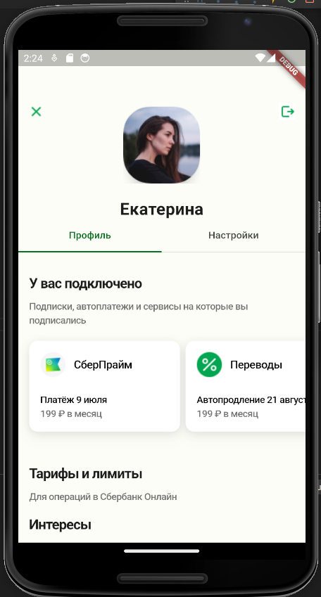
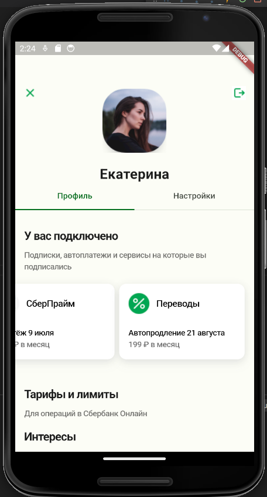
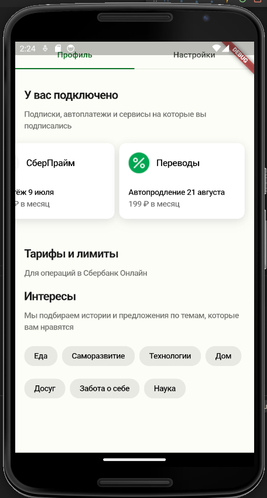
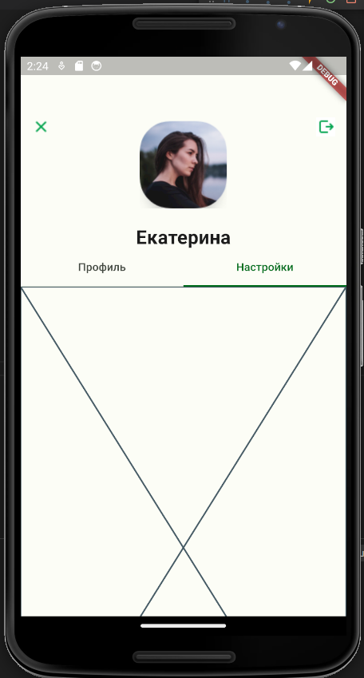
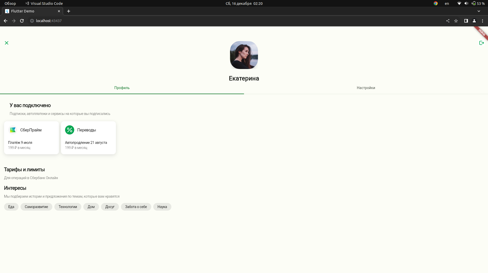
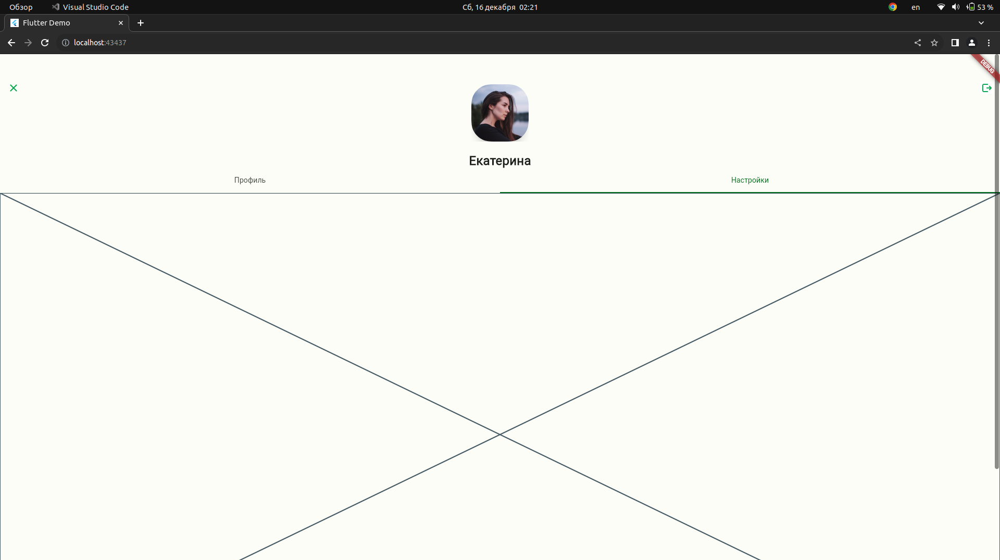
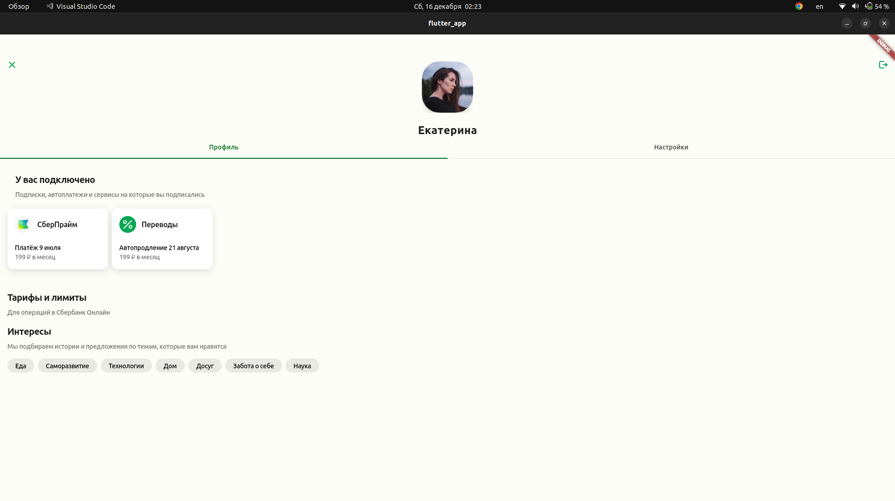
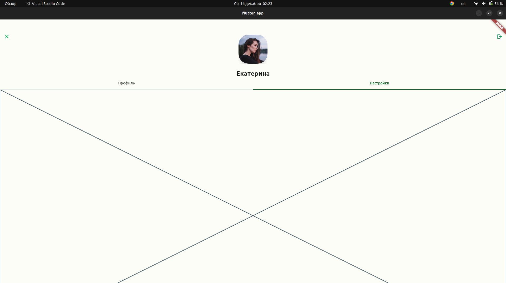

# flutter lab1
### Приложение запускается на android, web и linux, но для последних двух верстка не адаптивная.
### На ios приложение не запускал, потому что нет возможности (но наверное должно работать :thinking:).
### Тестирование приложения под android проводилось на эмуляторе Nexsus 6 с 34 версией API.
### Не успел доделать одну секуцию с тарифами, потому что и так очень сильно опоздал со сдачей лабы, если успею потом доделаю :face_exhaling:	.
### Скрины верстки под android:
 
 
 
 
### Скрины верстки под web:
 
 
### Скрины верстки под linux:
 
 
